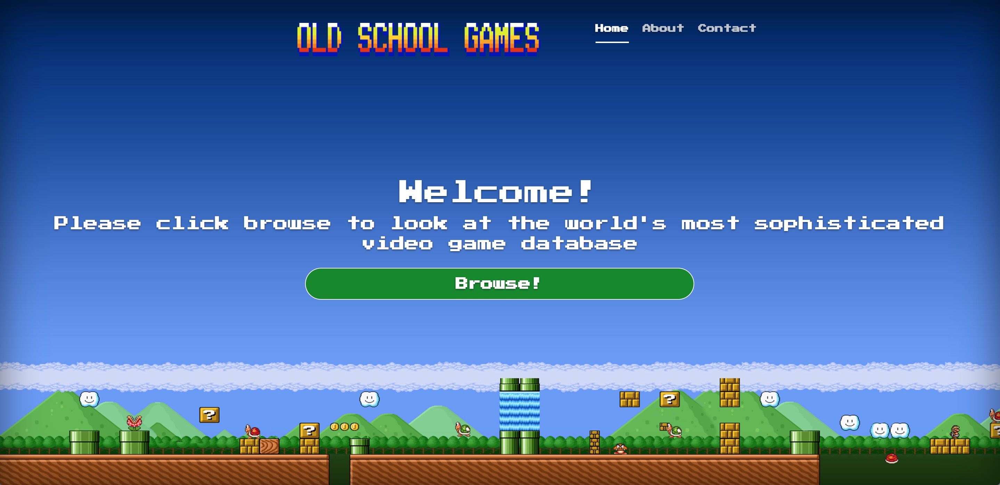
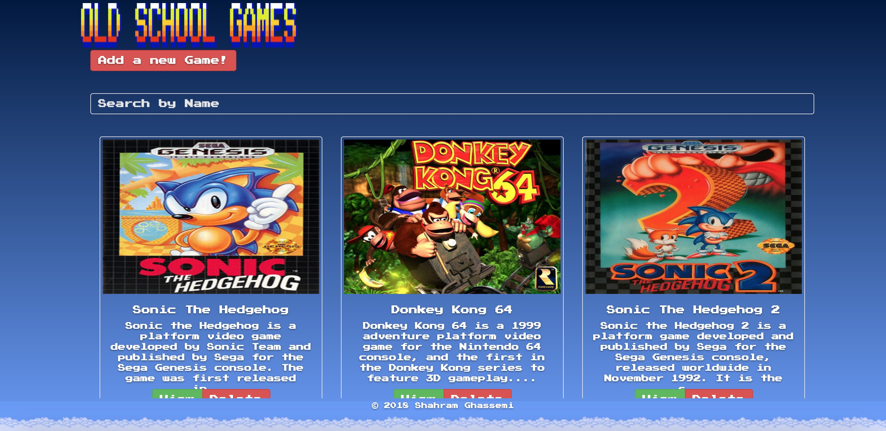
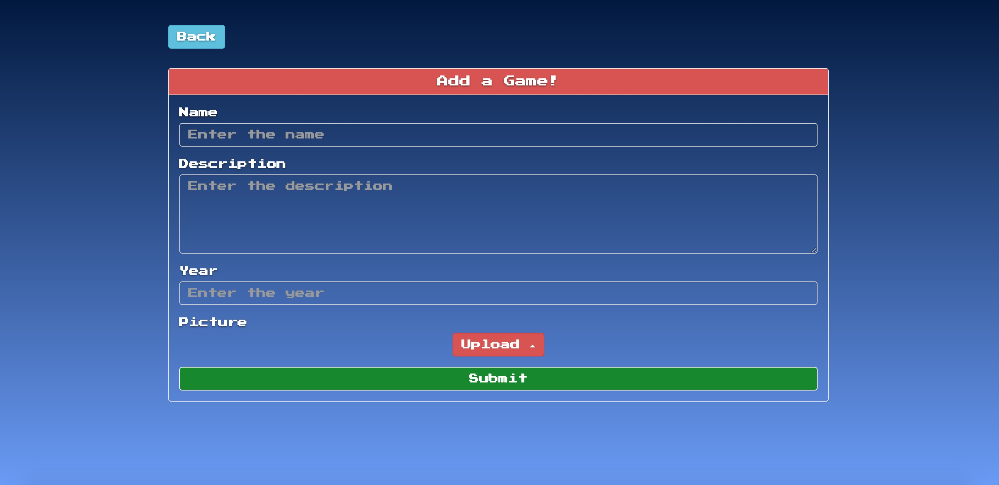
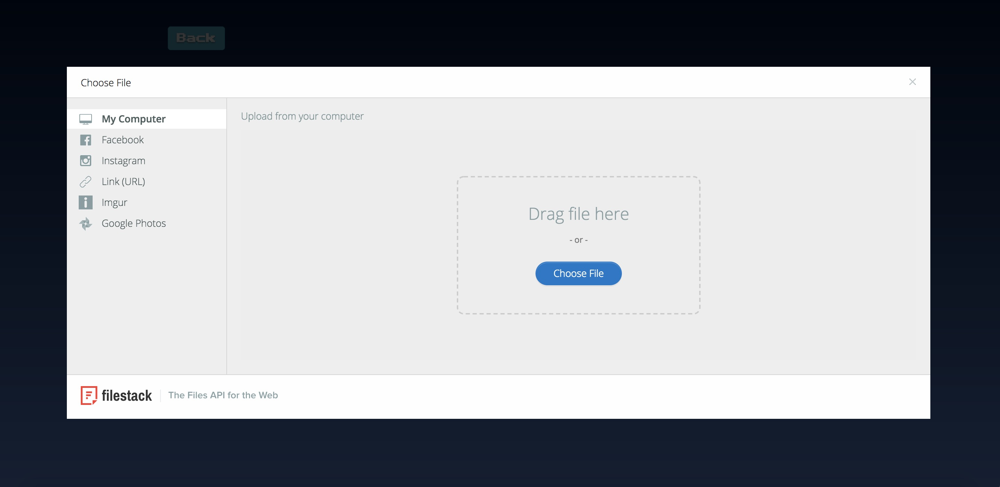
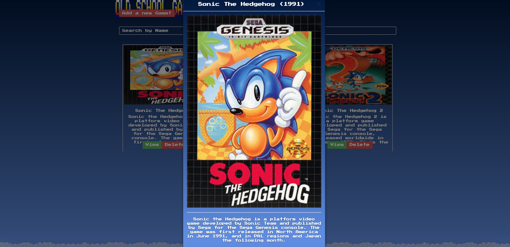

# Videogame-library-react
Old School Games is a video game library meant for the old school gamers out there. I have a fairly large collection of video games made in the late 80s all the way up to the early 2000s. The bulk of my video game collection is made up of Nintendo 64 and Sega Genesis games, although I also have many games for the Nintendo Game Cube and Playstation 2. All of my games are in great condition, and include the original box, manual and inserts which are preserved in plastic containers for each game. I grew up playing the Nintendo 64 and it will always be my favorite console of all time.

This app uses the MERN stack (MongoDB, Express.js, React-Redux and Node.js) and uses the Filestack API to store images. It uses AWS hosting for the front-end and Heroku for the back-end.

When you land on the main page, you can click browse which will take you to the video game library, or you can click on "About" or "Contact" in the top right to get a bit more information about the app as well as my contact information.

When you click browse, you will see the video game library displayed. All the games displayed have been previously added and stored on the MongoDB add-on on Heroku. To add a video game, simply click the "Add a new Game" button in the top right.

In order to add a game, you need to provide some information about it such as the name, the description of the game, the year it was released, and a picture of the cover art.

When adding cover art for a video game, the Filestack API gives you many options. Your computer, Facebook, Instagram, Google Photos, imgur, or also a link to a picture. When you choose an option, the picture gets stored on Filestack which works with MongoDB to provide the cover art when you are browsing the video game library.

Finally, when you have added a game, you can click on "View" under the game to see a modal which shows all the information you entered as well as the cover art. You can also delete games from the library using the "Delete" button.

